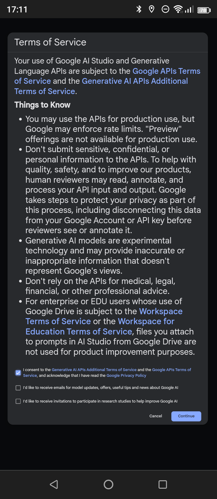
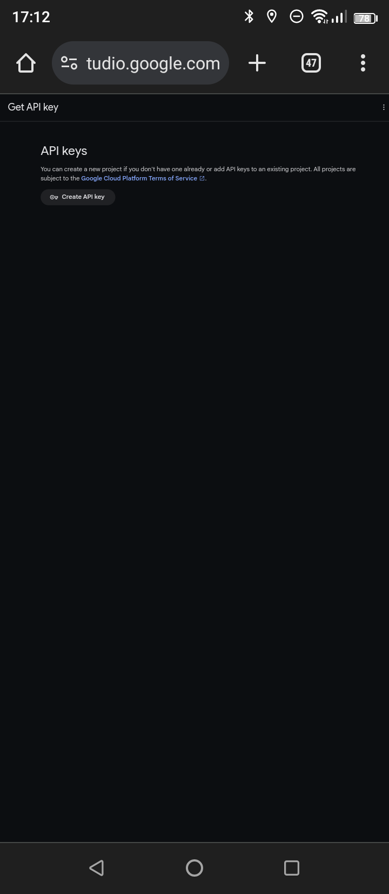

# 社会資源コンシェルジュ

社会資源コンシェルジュは、必要な社会資源情報を検索しやすくするためのWebアプリケーションです。このツールは、GitHub Pages上で直接使用することができます。

## 1. プロジェクトの公開

プロジェクトはGitHub Pagesに公開されており、以下のURLからアクセスできます：

[社会資源コンシェルジュ](https://shinyryo.github.io/BasicChatBot/)

## 2. 使用方法

Webアプリケーションを使用するには、Google AI StudioからAPIキーを取得し、Webアプリケーション内で利用する必要があります。

### 2-1. APIキーの取得

Google AI StudioでAPIキーを取得するには以下の手順に従ってください。

1. [Google AI StudioのAPIキー作成ページ](https://aistudio.google.com/app/apikey)を開きます。
2. 利用規約に同意し、「Continue」をクリックします。
3. 「Create API key」をクリックし、新規プロジェクトの作成か既存プロジェクトへの追加を選びます。
4. APIキーが生成されたら、コピーしてアプリケーションで使用します。

**注意：APIキーは秘密にしてください。**

利用規約の同意、APIキーの作成、APIキーのコピーのスクリーンショットはこちらです：

- APIキーのコピーのスクリーンショット
- 
# 参考
## 1. [onikarubiさん](https://github.com/onikarubi/genai/blob/master/main.js)

## ライセンス

このプロジェクトは[MITライセンス](LICENSE)の下で公開されています。

---

上記のテキストにリンクや画像を追加する場合は、実際のURLや画像のパスに置き換えてください。GitHub Pagesでの具体的な操作方法やAPIキーの取り扱いに関する注意事項も、利用者にわかりやすいように記述されています。
